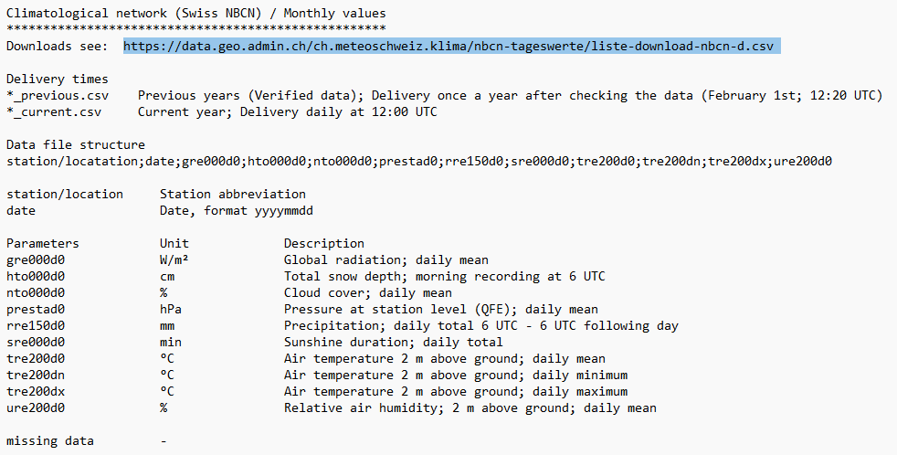

<style>
body {
text-align: justify}
</style>

```{css, echo=FALSE}
pre, code {white-space:pre !important; overflow-x:auto}
```

```{r setup, include=FALSE}
knitr::opts_chunk$set(echo = TRUE, warning = FALSE, message = FALSE)

library(tidyverse)
library(tidymodels)
library(textrecipes)
library(doParallel)
library(snow)
library(vip)
library(broom)
library(car)
library(stacks)
library(lubridate)
library(modeltime)
library(timetk)
```

***
#### What is this project about?
***

The goal of this project is to test the ability of supervised machine learning models, namely elastic net, gradient boosting and random forest, to predict end-user electricity consumption in Switzerland. The goal for the final product is a model that takes on a date in the future, as well as temperature data, and gives out an accurate estimate of aggregate electricity demand in Switzerland.

The electricity demand data comes from [Swissgrid](https://www.swissgrid.ch/en/home/operation/grid-data/generation.html) and is denoted in $kwh$. Additionally, I will use historical weather data as an additional predictor, which comes from [Swiss NBCN](https://data.geo.admin.ch/ch.meteoschweiz.klima/nbcn-tageswerte/liste-download-nbcn-d.csv). 
To give a short idea of the structure of this document, I will

- Procure and clean the data;
- Explore the data;
- Build and tune initial models;
- Evaluate initial model performance to focus on one model;
- Proceed with thorough tuning of one model;
- Evaluate model performance in the out-of-sample period;
- Present limitations.

<br>

***
#### Data procurement and data cleaning
***

##### End-user electricity demand data

Firstly, I start by loading the data from Swissgrid. Looking at the first 10 rows, it becomes clear that Swissgrid denotes the demand data in 15 minute intervals.

```{r, echo=FALSE}
data <- readxl::read_excel("Data/5 EnergieEndverbrauch2009-2022.xlsx") %>% 
  janitor::clean_names() %>% 
  rename(date = zeitpunkt, kwh = k_wh)
```

```{r class.source = 'fold-show'}
head(data, n = 10)
```

Luckily, there are no missing values. However, the frequency for modelling is is too granular. For this project, I would like to forecast energy demand going one year into the future, to see the ability of the model over longer seasonality time periods. Limitations of a forecasting time frame of this magnitude are presented in the last section. To proceed, I aggregate to daily values:

```{r class.source = 'fold-show'}
data <- data %>% 
  mutate(year = year(date),
         day_in_year = yday(date)) %>% 
  filter(year <= 2021) %>% 
  group_by(year, day_in_year) %>% 
  summarise(date = last(date) %>% as.Date(),
            mwh = sum(kwh)/1e3) %>% 
  ungroup()

summary(data)
```

<br>

##### Temperature Data

The picture below shows a document I got from [opendata.swiss](https://opendata.swiss/de/dataset/klimamessnetz-tageswerte). 

```{r, echo=FALSE, out.width="100%"}

```

In it, I found a link (highlighted) that led to a file with various weather stations and their respective data download links:

```{r}
read_csv("Data/liste-download-nbcn-d.csv") %>% 
  glimpse()
```

Therefore, I could use these URLs to access the actual weather data for selected weather stations. I stored the data for all stations of interest in the tibble _weather_data_. The weather stations I have decided for are both in densely populated areas in northern/eastern/western Switzerland, as well as in the Alps, ensuring a good representation of the whole country.

```{r, eval=FALSE}
# weather_data <- read_csv("Data/liste-download-nbcn-d.csv") %>%
#   filter(`station/location` %in% c("SMA", "GVE", "BAS", "DAV","LUG", "STG",
#                                    "ALT", "NEU", "BER", "LUZ")) %>%
#   mutate(station_data = map(`URL Previous years (verified data)`,
#                             ~ read.csv(.x, sep = ";")),
#          station_data = map(station_data,
#                             ~ select(.x, date, tre200d0, rre150d0,
#                                      nto000d0, ure200d0)),
#          station_data = map(station_data,
#                             ~ na_if(.x, "-")),
#          station_data = map(station_data,
#                             ~ .x %>%
#                               mutate(date = as.character(date),
#                                      across(c(tre200d0, rre150d0,
#                                               nto000d0, ure200d0), as.numeric)))) %>%
#   select(Station, `station/location`, Canton, station_data) %>%
#   unnest(station_data) %>%
#   mutate(date = ymd(date)) %>%
#   select(-Station, -Canton) %>% 
#   pivot_longer(c(tre200d0, rre150d0, nto000d0, ure200d0)) %>% 
#   mutate(name = case_when(
#     name == "tre200d0" ~ paste0(`station/location`,"_","meantemp"),
#     name == "rre150d0" ~ paste0(`station/location`,"_","precipitation"),
#     name == "nto000d0" ~ paste0(`station/location`,"_","cloudcoverage"),
#     name == "ure200d0" ~ paste0(`station/location`,"_","humidity"))) %>% 
#   select(-`station/location`) %>% 
#   pivot_wider(names_from = "name", values_from = "value")
```

```{r, eval=FALSE, echo=FALSE}
write_csv(weather_data, "Data/weather_data.csv")
```

```{r, echo=FALSE}
weather_data <- read_csv("Data/weather_data.csv")
```

From here, I have demand and temperature data, which I can left-join. Additionally, I create averages of the weather readings over all stations, to get an "average Swiss" value. Namely, I create averages for:

- temperature,
- precipitation,
- cloud coverage,
- humidity.

Starting by left-joining the data:

```{r}
data <- data %>%
  left_join(weather_data, by = "date")
```

Followed by the creation of the averages, for all of the four measures outlined in the bullet point list above:

```{r, }
data <- data %>% 
  left_join(data %>% 
              select(-c(mwh)) %>% 
              pivot_longer(c(ALT_meantemp:STG_humidity)) %>% 
              separate(col = name, into = c("location_code", "measure"), 
                       sep = "_", remove = F) %>% 
              group_by(date, measure) %>% 
              summarise(avg = mean(value, na.rm = T)) %>% 
              pivot_wider(names_from = measure, values_from = avg),
            by = "date")
```

After doing this, I check for missing values again, because new weather data came in:

```{r, warning=FALSE, message=FALSE}
colMeans(is.na(data)) %>% 
  tidy() %>% 
  filter(x > 0) %>% 
  transmute(variable = names, missing_percentage = x)
```

It becomes visible that not all stations have cloud coverage data for all, or even for any, points in time. Variables with low percentages of missing values can be imputed or left out at a later stage, but everything above half of the data missing is generally considered problematic. Therefore, in a next step, the variables with _missing_percentage_ larger than 50% are dropped:

```{r, message=FALSE, warning=FALSE}
data <- data %>% 
  select(-c(colMeans(is.na(data)) %>% 
              tidy() %>% 
              filter(x > 0.5) %>% 
              pull(names)))
```

Now, the final data is clean and ready to be used for model training. As a last step in the data cleaning process, I split it into pre- and post-COVID for the later test of the model regarding robustness during corona years, which is also part of the last section on limitations.

```{r}
data_corona <- data %>% 
  filter(year > 2019)

data <- data %>% 
  filter(year <= 2019)
```

There are 43 variables, 42 numeric predictors and 1 numeric target variable.

```{r}
glimpse(data)
```

At this stage, we are ready to move on to exploring the data.

<br >

***
#### Exploratory Data Analysis
***

Exploratory data analysis (EDA) is a tool for exploring the relation between predictors and the target variable of a data set prior to building models. It is important to get a mental picture of the data and helps thinking about how to approach the problem.

```{r, fig.width=8, fig.height=4.95, dpi=300, dev="png", warning=FALSE}
data %>% 
  mutate(day_in_week = wday(date),
         day = wday(date, label = T),
         weekend = case_when(
           day_in_week %in% c(7) ~ "Saturday",
           day_in_week %in% c(1) ~ "Sunday",
           TRUE ~ "Work Day") %>% 
           factor(levels = c("Work Day", "Saturday", "Sunday"))) %>% 
  ggplot(aes(day_in_year, mwh, colour = weekend)) +
  geom_point(alpha = 0.4) +
  labs(title = "Swiss End-User Electricity Consumption",
       subtitle = "For each day in the year (1-365), 11 daily consumption points from the period 2009 to 2019 are plotted.\nColouring indicates if a day lies on a weekend or not.",
       caption = "Data Source: Swissgrid, Period 2009-2019",
       x = "Day Of The Year (1-365)",
       y = "Daily Consumption",
       colour = NULL) +
  scale_x_continuous(breaks = c(1, seq(50,366,50))) +
  scale_y_continuous(labels = comma_format(suffix = " MWh")) +
  ggsci::scale_colour_jama() +
  theme_bw() +
  theme(plot.title = element_text(face = "bold", size = 14),
        plot.subtitle = element_text(face = "italic", size = 10,
                                     colour = "grey50"),
        plot.caption = element_text(face = "italic", size = 9,
                                    colour = "grey50"),
        legend.position = "right")
```

This first chart shows electricity consumption as a function of the day of the year (number 1 to 366) over the period 2009-2019. Clearly, electricity demand peaks in winter and is lowest in summer. Furthermore, there are fixed effects for work days and the two days on the weekends. The conclusion from this chart is that including dummies for day of the week and day of the year is likely important, as well as accounting for intra-year seasonality.

```{r, fig.width=8, fig.height=3, dpi=300, dev="png", warning=FALSE, message=FALSE}
data %>% 
  filter(year == 2010) %>%
  ggplot(aes(date, mwh)) +
  geom_line(colour = "dodgerblue", size = 0.75) +
  labs(title = "Swiss Daily Energy Consumption in 2010",
       y = "Daily Consumption",
       x = NULL) +
  scale_y_continuous(labels = comma_format(suffix = " MWh")) +
  theme_bw() +
  theme(plot.title = element_text(face = "bold", size = 14),
        plot.subtitle = element_text(face = "italic", size = 10,
                                     colour = "grey50"),
        plot.caption = element_text(face = "italic", size = 9,
                                    colour = "grey50"),
        legend.position = "right")
```

Singling out one year randomly, 2010 for instance, reveals even more than intra-year seasonality. Additionally, there is intra-week seasonality, which needs to be accounted for, as seen before.

```{r, fig.width=8, fig.height=4.95, dpi=300, dev="png", warning=FALSE, message=FALSE}
data %>% 
  filter(year == 2019) %>% 
  select(date, meantemp, humidity, precipitation, cloudcoverage) %>% 
  pivot_longer(-date) %>% 
  ggplot(aes(date, value, colour = name)) +
  geom_line(size = 0.75, alpha = 0.75) +
  facet_wrap(~ name, scales = "free_y") +
  labs(title = "Weather Measurements in 2019",
       y = "Measurement",
       x = NULL,
       colour = NULL) +
  ggsci::scale_colour_jama() +
  theme_bw() +
  theme(plot.title = element_text(face = "bold", size = 14),
        plot.subtitle = element_text(face = "italic", size = 10,
                                     colour = "grey50"),
        plot.caption = element_text(face = "italic", size = 9,
                                    colour = "grey50"),
        legend.position = "right")
```

Looking at the chart above, only temperature shows visible seasonality. All other variables look erratic by themselves. However, let's look at a scatter plot to see potential linear relationships:

```{r, fig.width=8, fig.height=6, dpi=300, dev="png", warning=FALSE, message=FALSE}
data %>% 
  select(date, meantemp, cloudcoverage, humidity, precipitation, mwh) %>% 
  pivot_longer(-c(date, mwh)) %>% 
  mutate(day_in_week = wday(date),
         day = wday(date, label = T),
         weekend = case_when(
           day_in_week %in% c(7) ~ "Saturday",
           day_in_week %in% c(1) ~ "Sunday",
           TRUE ~ "Work Day") %>% 
           factor(levels = c("Work Day", "Saturday", "Sunday"))) %>% 
  ggplot(aes(value, mwh, colour = weekend)) +
  geom_point(alpha = 0.5, size = 0.75) +
  geom_smooth(size = 0.75, se = F) +
  facet_wrap(~ name, scales = "free_x") +
  labs(title = "Relation Between Weather Conditions And Electricity Demand",
       subtitle = "TBD",
       y = "Daily Electricity Demand",
       x = "Measurement",
       colour = NULL) +
  scale_y_continuous(labels = scales::comma_format(suffix = " MWh")) +
  scale_x_continuous(labels = scales::comma_format()) +
  ggsci::scale_colour_jama() +
  theme_bw() +
  theme(plot.title = element_text(face = "bold", size = 14),
        plot.subtitle = element_text(face = "italic", size = 10,
                                     colour = "grey50"),
        plot.caption = element_text(face = "italic", size = 9,
                                    colour = "grey50"),
        legend.position = "right")
```

The above chart reveals the relationships between weather measurements and the target variable electricity demand better. There is a very strong negative relationship between temperature and the target, with a non-linearity as soon as higher degree Celsius are attained. More clouds lead to higher demand. The same holds for humidity. Lastly, precipitation does not show a clear picture, albeit slightly negative. It has to be noted that the last three predictors leave much more variance unexplained than temperature.

After exploring the predictors in the data, I can move on to building initial models.

<br>

***
#### Building initial models
***

Before diving into hyperparameter tuning of the models, I will create three simple models using default parameters to judge the potential of them. The first step in modelling is creating the splits. In this case, the assignment is not random, but by time, as we are dealing with time series. I will use 10 years for training and predict on the holdout, which will be 2019. Additionally, I initiate the folds for cross-validation of the model metrics at a later stage in the tuning process.

```{r class.source = 'fold-show'}
dt_split <- data %>% 
  time_series_split(date_var = date, assess = "1 year", cumulative = T)

dt_train <- training(dt_split)
dt_test <- testing(dt_split)

folds <- vfold_cv(dt_train, v = 5)
```

Visualising the train/test split, it becomes very clear, what the goal will be: Forecasting the year 2019, for which we have the true data and are able to compute metrics to evaluate model performance.

```{r, fig.width=8, fig.height=3, dpi=300, dev="png", warning=FALSE, message=FALSE}
bind_rows(
  dt_train %>% mutate(id = "training"),
  dt_test %>% mutate(id = "testing")
) %>% 
  ggplot(aes(date, mwh, colour = id)) +
  geom_line() +
  scale_colour_manual(values = c("firebrick", "dodgerblue")) +
  labs(title = "Training/Testing Split", 
       y = NULL,
       x = NULL,
       colour = NULL) +
  scale_y_continuous(labels = comma_format(suffix = " MWh")) +
  theme_light() +
  theme(plot.title = element_text(face = "bold", size = 14),
        plot.subtitle = element_text(face = "italic", size = 10,
                                     colour = "grey50"),
        plot.caption = element_text(face = "italic", size = 9,
                                    colour = "grey50"),
        legend.position = "right")
```

The next step in the modelling process with the package _tidymodels_ is creating the recipe for data preprocessing. As I don't have a great amount of predictors, only date and weather information, I will try to squeeze as much information from the date column as possible. Namely, I

- use _step_date_ to get factor columns indicating day and month;
- use _step_holiday_ to create dummy variables for official holidays in Switzerland, on which business is interrupted;
- impute missing values in numeric predictors with the mean of the respective variable;
- fill missing values in nominal predictors with "unknown";
- create new variables for number of month, semester, weekday, number of the week, quarter and a dummy variable for christmas holidays;
- create dummy variables from nominal predictors (not for random forest, as the model can deal with it);
- remove zero variance predictors.

```{r class.source = 'fold-show'}
model_rec <- recipe(mwh ~ .,
                    data = dt_train) %>%
  step_date(date) %>%
  step_holiday(date, holidays = timeDate::listHolidays("CH")) %>%
  step_impute_mean(all_numeric_predictors()) %>% 
  step_unknown(all_nominal_predictors()) %>% 
  step_mutate(month = lubridate::month(date),
              year_half = lubridate::semester(date) %>% as.factor,
              week_day = lubridate::wday(date),
              week_in_year = lubridate::week(date),
              quarter = lubridate::quarter(date),
              date_christmas = ifelse(between(day_in_year, 358, 366),
                                      1, 0),
              day_in_year = as.factor(day_in_year)) %>% 
  step_rm(date) %>% 
  step_dummy(all_nominal_predictors(), one_hot = TRUE) %>%
  step_zv()

rf_rec <- recipe(mwh ~ .,
                 data = dt_train) %>%
  step_date(date) %>%
  step_holiday(date, holidays = timeDate::listHolidays("CH")) %>%
  step_impute_mean(all_numeric_predictors()) %>% 
  step_unknown(all_nominal_predictors()) %>% 
  step_mutate(month = lubridate::month(date),
              year_half = lubridate::semester(date) %>% as.factor,
              week_day = lubridate::wday(date),
              week_in_year = lubridate::week(date),
              quarter = lubridate::quarter(date),
              date_christmas = ifelse(between(day_in_year, 358, 366),
                                      1, 0),
              day_in_year = as.factor(day_in_year)) %>% 
  step_rm(date) %>%
  step_zv()
```

```{r, echo=FALSE, eval=FALSE}
model_rec %>% prep() %>% juice() %>% glimpse()
rf_rec %>% prep() %>% juice() %>% glimpse()
```

In a next step, I specify the three models, that I want to use. They are elastic net, gradient boosting and random forest. Elastic net is a linear combination of ridge and lasso regression, which are linear regressions with additional penalty terms. Gradient boosting and random forest are tree ensemble methods with different algorithm, which I will not explain in detail in this project, as the application and not the definition of these methods stands in focus.

```{r class.source = 'fold-show'}
en_spec <- linear_reg(penalty = 0.02, mixture = 0.5) %>% 
  set_engine("glmnet") %>% 
  set_mode("regression")

xg_spec <- boost_tree(trees = 1000) %>% 
  set_engine("xgboost") %>% 
  set_mode("regression")

rf_spec <- rand_forest(trees = 500) %>% 
  set_engine("ranger") %>% 
  set_mode("regression")
```

As I am not tuning hyperparameters at this stage yet and just set some default parameters, the workflows can immediately be entirely fit to the training data.

```{r class.source = 'fold-show', eval=FALSE}
en_wf_fit <- workflow() %>% 
  add_recipe(model_rec) %>% 
  add_model(en_spec) %>% 
  fit(dt_train)

xg_wf_fit <- workflow() %>% 
  add_recipe(model_rec) %>% 
  add_model(xg_spec) %>% 
  fit(dt_train)

rf_wf_fit <- workflow() %>% 
  add_recipe(rf_rec) %>% 
  add_model(rf_spec) %>% 
  fit(dt_train)
```

```{r, echo=FALSE, eval=FALSE}
saveRDS(en_wf_fit, "Models/en_wf_fit.rds")
saveRDS(xg_wf_fit, "Models/xg_wf_fit.rds")
saveRDS(rf_wf_fit, "Models/rf_wf_fit.rds")
```

```{r, echo=FALSE}
en_wf_fit <- readRDS("Models/en_wf_fit.rds")
xg_wf_fit <- readRDS("Models/xg_wf_fit.rds")
rf_wf_fit <- readRDS("Models/rf_wf_fit.rds")
```


***
#### Evaluating initial model performance
***

With the fitted initial models, I can now make predictions on the holdout data. I use the _predict_ function in combination with the _map_ function, which enables me to run each elements in a list (for instance a column with type list in a tibble) through a given function.

```{r class.source='fig-show'}
predictions <- tibble(
  type = c("RF", "EN", "GB"),
  wflow = list(rf_wf_fit, en_wf_fit, xg_wf_fit),
  predictions = map(.x = wflow, .f = ~ augment(.x, dt_test))
) %>% 
  select(-wflow) %>% 
  unnest(predictions)

predictions %>% select(date, mwh, .pred)
```

Now that I have the predictions on the holdout data set, I can compute evaluation metrics to compare the performance of each model. Clearly, gradient boosting and random forest have outperformed the elastic net.

```{r, dpi=300, fig.height=3, fig.width=8, warning=FALSE, message=FALSE, warning=FALSE}
evaluation_metrics <- metric_set(rsq, rmse, mae)

predictions %>% 
  group_by(type) %>% 
  evaluation_metrics(truth = mwh, estimate = .pred) %>% 
  select(-.estimator) %>% 
  pivot_wider(names_from = ".metric", values_from = ".estimate") %>% 
  arrange(-rsq)
```

Additionally, I plot the predictions and the actual values in a scatter plot:

```{r, dpi=300, fig.height=2, fig.width=8, warning=FALSE, message=FALSE, warning=FALSE}
predictions %>% 
  ggplot(aes(mwh, .pred)) +
  geom_point(alpha = 0.2, colour = "midnightblue", size = 2) +
  facet_wrap(~ type) +
  geom_abline(lty = "dashed", colour = "grey50") +
  scale_x_continuous(labels = scales::comma_format()) +
  scale_y_continuous(labels = scales::comma_format()) +
  theme_bw() +
  theme(axis.text.x = element_text(angle = 90, hjust = 1, vjust = 0.5))
```

Ideally, all points would lie on the diagonal line from the origin. The spread indicates that elastic net has performed worse than tree-based ensemble models. Furthermore, the gradient boosting has performed better than the random forest. Given these interim results, I will continue with the tuning for both gradient boosting and random forest and abandon the idea of using elastic net.

***
#### Building final models
***

With the knowledge from above, I will now tune hyperparameters for a random forest and gradient boosting model, to see whether I can fill the gaps of the initial models.

For the random forest model, I specify all three parameters, _mtry_, _min_n_ and _trees_ to be tuned. I also reset the workflow and add the recipe and the model specification. Lastly, I initiate the grid with the values which will be used for hyperparameter tuning. The use of a latin hypercube design ideally chooses hyperparameters to maximally fill out the potential hyperparameter space. This ensures efficient tuning with lower numbers of models to be tried. For 3 hyperparameters, I use 50 configurations, which will be fitted on 5 folds, therefore resulting in 250 fits.

```{r}
rf_spec <- rand_forest(mtry = tune(),
                       min_n = tune(),
                       trees = tune()) %>%
  set_engine("ranger") %>%
  set_mode("regression")

rf_wflow <- workflow() %>% 
  add_recipe(rf_rec) %>% 
  add_model(rf_spec)

rf_grid <- grid_latin_hypercube(finalize(mtry(), dt_train),
                                min_n(),
                                trees(),
                                size = 50)
```

I approach the gradient boosting model with the same approach. For 6 hyperparameters, I use 100 model configurations which will be fitted on all 5 folds each, resulting in 500 fits.

```{r}
gb_spec <- boost_tree(mtry = tune(),
                      trees = tune(),
                      min_n = tune(),
                      tree_depth = tune(),
                      learn_rate = tune(),
                      loss_reduction = tune()) %>%
  set_engine("xgboost") %>%
  set_mode("regression")

gb_wflow <- workflow() %>% 
  add_recipe(model_rec) %>% 
  add_model(gb_spec)

gb_grid <- grid_latin_hypercube(finalize(mtry(), dt_train),
                                trees(),
                                min_n(),
                                tree_depth(),
                                learn_rate(),
                                loss_reduction(),
                                size = 100)
```

With everything specified, I proceed with the actual tuning. I use parallel processing with a function obtained from Stackoverflow [here](https://stackoverflow.com/questions/64519640/error-in-summary-connectionconnection-invalid-connection) and a function from the _doParallel_ package, which enables me to open and close 6 cores instead of 1, speeding up the training process tremendously. The actual tuning function takes on the workflow, the grid with the parameters and the cross-validation resamples.

```{r, eval=FALSE}
# Random Forest
unregister_dopar <- function() {
  env <- foreach:::.foreachGlobals
  rm(list=ls(name=env), pos=env)
}

cl <- makePSOCKcluster(6)
registerDoParallel(cl)

rf_tune <- tune_grid(object = rf_wflow,
                     grid = rf_grid,
                     resamples = folds)

stopCluster(cl)
unregister_dopar()

# Gradient Boosting
unregister_dopar <- function() {
  env <- foreach:::.foreachGlobals
  rm(list=ls(name=env), pos=env)
}

cl <- makePSOCKcluster(6)
registerDoParallel(cl)

gb_tune <- tune_grid(object = gb_wflow,
                     grid = gb_grid,
                     resamples = folds)

stopCluster(cl)
unregister_dopar()
```

```{r, echo=FALSE, eval=FALSE}
saveRDS(rf_tune, "Models/rf_tune.rds")
saveRDS(gb_tune, "Models/gb_tune.rds")
```

```{r, echo=FALSE}
rf_tune <- readRDS("Models/rf_tune.rds")
gb_tune <- readRDS("Models/gb_tune.rds")
```

After this function has run, I can now compare the tuning results. Random forest has performed better after tuning, with an increase of $R^2$ of about 2 percentage points. 

```{r}
rf_tune %>% 
  show_best(metric = "rsq")
```

```{r}
gb_tune %>% 
  show_best(metric = "rsq")
```

Gradient boosting performed slightly better, but the improvement is likely statistically and economically insignificant, so we can call it the same.

With these results, I fit the models with the best configurations from in-sample training onto the entire training data set from the split initiated at the very beginning:

```{r, eval=FALSE}
gb_final_fit <- gb_wflow %>% 
  finalize_workflow(select_best(gb_tune, metric = "rsq")) %>% 
  last_fit(dt_split)

rf_final_fit <- rf_wflow %>% 
  finalize_workflow(select_best(rf_tune, metric = "rsq")) %>% 
  last_fit(dt_split)
```

```{r, echo=FALSE, eval=FALSE}
saveRDS(gb_final_fit, "Models/gb_final_fit.rds")
saveRDS(rf_final_fit, "Models/rf_final_fit.rds")
```

```{r, echo=FALSE}
gb_final_fit <- readRDS("Models/gb_final_fit.rds")
rf_final_fit <- readRDS("Models/rf_final_fit.rds")
```

After this, the final models are done.

***
#### Evaluating final model performance
***

With the final models, I can now finally explore the performance on the out-of-sample data, which was held out from model training.

```{r, fig.width=8, fig.height=4, dpi=300, dev="png", warning=FALSE, message=FALSE}
bind_rows(
  rf_final_fit %>% 
    collect_predictions() %>% 
    mutate(model = "Random Forest"),
  gb_final_fit %>% 
    collect_predictions() %>% 
    mutate(model = "Gradient Boosting")
) %>% 
  select(model, mwh, .pred) %>% 
  ggplot(aes(mwh, .pred)) +
  geom_point(alpha = 0.5, size = 1.5, colour = "midnightblue") +
  facet_wrap(~ model) +
  labs(title = "Out-Of-Sample Model Performance",
       y = "Estimate",
       x = "Truth") +
  geom_abline(colour = "grey50", lty = "dashed") +
  scale_y_continuous(labels = scales::comma_format(suffix = " MWh")) +
  scale_x_continuous(labels = scales::comma_format(suffix = " MWh")) +
  theme_bw() +
  theme(plot.title = element_text(size = 14, face = "bold"),
        plot.subtitle = element_text(face = "italic", size = 12,
                                     colour = "grey50"),
        axis.text.x = element_text(angle = 90, hjust = 1, vjust = 0.5))
```

From the above chart, it becomes visually clear that the gradient boosting shows fewer outliers than the random forest, explaining the better $R^2$ of the first. 

Looking at out-of-sample model evaluation metrics in the table below, it looks like the gradient boosting model performed better than the random forest, although both performed very well.

```{r}
bind_rows(
  rf_final_fit %>% 
    collect_predictions() %>% 
    mutate(model = "Random Forest"),
  gb_final_fit %>% 
    collect_predictions() %>% 
    mutate(model = "Gradient Boosting")
) %>% 
  group_by(model) %>% 
  evaluation_metrics(truth = mwh, estimate = .pred) %>% 
  select(-.estimator) %>% 
  pivot_wider(names_from = ".metric", values_from = ".estimate")
```

At this stage, I can plot the actual time series against the predictions of the model, in order to see difference in time:

```{r, fig.width=8, fig.height=4.95, dpi=300, dev="png", warning=FALSE, message=FALSE}
bind_rows(
  gb_final_fit %>% 
    extract_workflow() %>% 
    augment(dt_test) %>% 
    mutate(model = "Gradient Boosting"),
  rf_final_fit %>% 
    extract_workflow() %>% 
    augment(dt_test) %>% 
    mutate(model = "Random Forest")
) %>% 
  transmute(date, model, prediction = .pred, actual = mwh) %>% 
  pivot_longer(-c(date, model)) %>% 
  ggplot(aes(date, value, colour = name)) +
  geom_line(alpha = 0.75, size = 0.75) +
  facet_wrap(~ model, nrow = 2) +
  labs(title = "Out-Of-Sample Time Series",
       y = NULL,
       x = NULL,
       colour = NULL) +
  ggsci::scale_colour_jama() +
  scale_y_continuous(labels = scales::comma_format(suffix = " MWh")) +
  theme_bw() +
  theme(plot.title = element_text(size = 14, face = "bold"),
        plot.subtitle = element_text(face = "italic", size = 12,
                                     colour = "grey50"))
```

Both models have a very good fit. The gradient boosting model has slightly higher accuracy on most weeks than random forest. At this stage, I would like to know what the average error in percentage terms of the model is. Therefore, I calculate the mean absolute error and divide it by the mean of the time series:

```{r}
mean_abs_error <- gb_final_fit %>%
  extract_workflow() %>% 
  augment(dt_test) %>% 
  mae(mwh, .pred) %>% 
  pull(.estimate)

mean_mwh <- gb_final_fit %>%
  extract_workflow() %>% 
  augment(dt_test) %>% 
  summarise(mean(mwh)) %>% 
  pull()

mean_abs_error/mean_mwh
```

The model has an average deviation of less than 2%, which is very good considering the only predictors being date and weather.

Next, I want to look at the errors (delta) of the predictions over the actual values as a function of time:

```{r, fig.width=8, fig.height=4.95, dpi=300, dev="png", warning=FALSE, message=FALSE}
bind_rows(
  gb_final_fit %>% 
    extract_workflow() %>% 
    augment(dt_test) %>% 
    mutate(model = "Gradient Boosting"),
  rf_final_fit %>% 
    extract_workflow() %>% 
    augment(dt_test) %>% 
    mutate(model = "Random Forest")
) %>% 
  mutate(delta = .pred/mwh-1,
         exceedance = ifelse(abs(delta) > 0.05, 
                             ">5%", "<=5%") %>% as.factor()) %>% 
  ungroup() %>% 
  ggplot(aes(date, delta, colour = exceedance)) +
  geom_point(alpha = 0.5) +
  annotate("rect", xmin = ymd("20180101"), xmax = ymd("20201231"),
           ymin = -0.05, ymax = 0.05, alpha = .1, fill = "dodgerblue") +
  geom_hline(yintercept = 0.05, colour = "dodgerblue", lty = "dashed") +
  geom_hline(yintercept = -0.05, colour = "dodgerblue", lty = "dashed") +
  facet_wrap(~ model, nrow = 2) +
  labs(title = "Out-Of-Sample Delta In Percent",
       subtitle = "Delta calculated as deviation of the estimate from the actual value.",
       y = "Delta",
       x = NULL,
       colour = "Exceedance") +
  scale_colour_manual(values = c("dodgerblue", "firebrick")) +
  scale_y_continuous(labels = scales::percent_format(), 
                     limits = c(-0.25, 0.25)) +
  coord_cartesian(xlim = c(ymd("20190101"), ymd("20191231"))) +
  theme_bw() +
  theme(plot.title = element_text(size = 14, face = "bold"),
        plot.subtitle = element_text(face = "italic", size = 12,
                                     colour = "grey50"),
        legend.position = "bottom")
```

In the above chart, I have plotted the relative deviation of the predictions versus the actual values. The blue confidence band marks the 5% relative deviation interval. As can be seen, most values lie within the interval, but sometimes, outliers cannot be avoided from either model. Likely, these are holidays that vary each year, like Easter.

Lastly, I would like to see how the model performs against just predicting the mean of each day from the training data:

```{r}
data %>% 
  group_by(day_in_year) %>% 
  summarise(predicting_daily_mean = mean(mwh)) %>% 
  ungroup() %>% 
  head(365) %>% 
  bind_cols(
    gb_final_fit %>% 
      extract_workflow() %>% 
      predict(dt_test) %>% 
      rename(gradient_boosting = .pred)
  ) %>% 
  bind_cols(dt_test %>% select(date, mwh)) %>% 
  pivot_longer(-c(day_in_year, mwh, date)) %>% 
  group_by(name) %>% 
  evaluation_metrics(truth = mwh, estimate = value) %>% 
  select(-.estimator) %>% 
  pivot_wider(names_from = .metric, values_from = .estimate)
```

From the performance metrics, it becomes abundantly clear that the model performance much better than the mean prediction. The same thing visualised as a time series:

```{r, fig.width=8, fig.height=3, dpi=300, dev="png", warning=FALSE, message=FALSE}
data %>% 
  group_by(day_in_year) %>% 
  summarise(predicting_daily_mean = mean(mwh)) %>% 
  ungroup() %>% 
  head(365) %>% 
  bind_cols(
    gb_final_fit %>% 
      extract_workflow() %>% 
      predict(dt_test) %>% 
      rename(gradient_boosting = .pred)
  ) %>% 
  bind_cols(dt_test %>% transmute(date, actuals = mwh)) %>% 
  pivot_longer(-c(day_in_year, date)) %>% 
  ggplot(aes(date, value, colour = name)) +
  geom_line(alpha = 0.75, size = 0.5) +
  labs(title = "Out-of-sample Time Series",
       y = NULL,
       x = NULL,
       colour = NULL) +
  ggsci::scale_colour_jama() +
  scale_y_continuous(labels = scales::comma_format(suffix = " MWh")) +
  theme_bw() +
  theme(plot.title = element_text(size = 14, face = "bold"),
        plot.subtitle = element_text(face = "italic", size = 12,
                                     colour = "grey50"))
```

Clearly, the gradient boosting model shows solid performance and could be used on future data points, after retraining on newer data.

<br>

***
#### Limitations
***

Before the end, I want to include some limitations where the model might show deficiencies.

<br>

##### Performance in unforeseen circumstances

Performance of predictive model relies heavily on the continuance of the relation of predictors with the target variable. If the relation breaks down due to unforeseen circumstances like a pandemic, then the model will act as if this event had never happened.

Let me (shortly) demonstrate this, using the data from 2020-2022, which I held out at the beginning for this exact purpose. I can now send this new data through the model and make predictions. Looking at the time series reveals the problem:

```{r, fig.width=8, fig.height=2, dpi=300, dev="png", warning=FALSE, message=FALSE}
gb_final_fit %>% 
  extract_workflow() %>% 
  augment(data_corona) %>%
  transmute(date, prediction = .pred, actual = mwh) %>% 
  pivot_longer(-c(date)) %>% 
  ggplot(aes(date, value, colour = name)) +
  geom_line(alpha = 0.75, size = 0.5) +
  labs(title = "Out-Of-Sample Time Series: Corona Period",
       y = NULL,
       x = NULL,
       colour = NULL) +
  ggsci::scale_colour_jama() +
  scale_y_continuous(labels = scales::comma_format(suffix = " MWh")) +
  theme_bw() +
  theme(plot.title = element_text(size = 14, face = "bold"),
        plot.subtitle = element_text(face = "italic", size = 12,
                                     colour = "grey50"))
```

The model predicted as if the pandemic had never hit. Without retraining and lookback on past values, the model completely mispredicts the future, which is especially grave during the first lockdown period as shown in the chart below. Looking at the delta over time shows this lockdown period nicely.

```{r, fig.width=8, fig.height=4, dpi=300, dev="png", warning=FALSE, message=FALSE}
gb_final_fit %>% 
  extract_workflow() %>% 
  augment(data_corona) %>%
  group_by() %>% 
  mutate(delta = .pred/mwh-1,
         exceedance = ifelse(abs(delta) > 0.05, 
                             ">5%", "<=5%") %>% as.factor()) %>% 
  ungroup() %>% 
  ggplot(aes(date, delta, colour = exceedance)) +
  geom_point(alpha = 0.5) +
  annotate("rect", xmin = ymd("20180101"), xmax = ymd("20251231"),
           ymin = -0.05, ymax = 0.05, alpha = .1, fill = "dodgerblue") +
  annotate("rect", xmin = ymd("20200310"), xmax = ymd("20200628"),
           ymin = -1, ymax = 1, alpha = .1, fill = "firebrick") +
  geom_hline(yintercept = 0.05, colour = "dodgerblue", lty = "dashed") +
  geom_hline(yintercept = -0.05, colour = "dodgerblue", lty = "dashed") +
  labs(title = "Out-Of-Sample Delta In Percent: Corona Period",
       subtitle = "Delta calculated as deviation of the estimate from the actual value.\nLockdown period in 2020 indicated by red shading.",
       y = "Delta",
       x = NULL,
       colour = "Exceedance") +
  scale_colour_manual(values = c("dodgerblue", "firebrick")) +
  scale_y_continuous(labels = scales::percent_format()) +
  coord_cartesian(xlim = c(ymd("20200101"), ymd("20220101")),
                  ylim = c(-0.17,0.32)) +
  theme_bw() +
  theme(plot.title = element_text(size = 14, face = "bold"),
        plot.subtitle = element_text(face = "italic", size = 12,
                                     colour = "grey50"),
        legend.position = "bottom")
```

The cloud of red points during the first lockdown shows the model overestimating demand. This abnormal effect has not happened again as the Swiss government have made a strong effort to keep the economy running, however, the period of a couple of months showed the vulnerability of the model. It must be noted that this vulnerability is not unique to this model, virtually all models inferring from the past are subject to it.

<br>

##### General usability in the energy sector

In practice, the forecast is usually much shorter than one year. Production is adjusted almost in real-time, so forecasts over long time-periods are not useful. Additionally, changing conditions of the predictors have to be accounted for, which is more feasible in real-time, short-term models. This goes hand in hand with the next point.

<br>

##### Weather readings

The weather readings for the training of this model were actual values. In practice, when predicting energy demand, weather forecasts are part of the features, instead of actual values. This additional uncertainty will likely impact model performance negatively in practice.

***
### Day Ahead Predictions With Autoregression
***

```{r}
dt_split <- data %>% 
  arrange(date) %>% 
  mutate(mwh_lag1 = lag(mwh, n = 1),
         mwh_lag2 = lag(mwh, n = 2),
         mwh_lag3 = lag(mwh, n = 3),
         mwh_lag4 = lag(mwh, n = 4),
         mwh_lag5 = lag(mwh, n = 5),
         mwh_lag6 = lag(mwh, n = 6),
         mwh_lag7 = lag(mwh, n = 7)) %>% 
  time_series_split(date_var = date, assess = "1 year", cumulative = T)

dt_train <- training(dt_split)
dt_test <- testing(dt_split)

folds <- vfold_cv(dt_train, v = 5)  
```


```{r class.source = 'fold-show'}
model_rec <- recipe(mwh ~ .,
                    data = dt_train) %>%
  step_date(date) %>%
  step_holiday(date, holidays = timeDate::listHolidays("CH")) %>%
  step_impute_mean(all_numeric_predictors()) %>% 
  step_unknown(all_nominal_predictors()) %>% 
  step_mutate(month = lubridate::month(date),
              year_half = lubridate::semester(date) %>% as.factor,
              week_day = lubridate::wday(date),
              week_in_year = lubridate::week(date),
              quarter = lubridate::quarter(date),
              date_christmas = ifelse(between(day_in_year, 358, 366),
                                      1, 0),
              day_in_year = as.factor(day_in_year)) %>% 
  step_rm(date) %>% 
  step_dummy(all_nominal_predictors(), one_hot = TRUE) %>%
  step_zv()
```

```{r, echo=FALSE, eval=FALSE}
model_rec %>% prep() %>% juice() %>% glimpse()
```

```{r}
gb_spec <- boost_tree(mtry = tune(),
                      trees = tune(),
                      min_n = tune(),
                      tree_depth = tune(),
                      learn_rate = tune(),
                      loss_reduction = tune()) %>%
  set_engine("xgboost") %>%
  set_mode("regression")

gb_wflow <- workflow() %>% 
  add_recipe(model_rec) %>% 
  add_model(gb_spec)

gb_grid <- grid_latin_hypercube(finalize(mtry(), dt_train),
                                trees(),
                                min_n(),
                                tree_depth(),
                                learn_rate(),
                                loss_reduction(),
                                size = 200)
```

```{r, eval=FALSE}
# Gradient Boosting
unregister_dopar <- function() {
  env <- foreach:::.foreachGlobals
  rm(list=ls(name=env), pos=env)
}

start_time <- Sys.time()

cl <- makePSOCKcluster(6)
registerDoParallel(cl)

gb_tune <- tune_grid(object = gb_wflow,
                     grid = gb_grid,
                     resamples = folds,
                     metrics = metric_set(rsq, rmse, mae, mape, mase),
                     control = control_grid(save_pred = TRUE))

Sys.time() - start_time

stopCluster(cl)
unregister_dopar()
```

```{r}
gb_final_fit <- gb_wflow %>% 
  finalize_workflow(select_best(gb_tune, metric = "rmse")) %>% 
  last_fit(dt_split)
```

```{r, fig.width=8, fig.height=4, dpi=300, dev="png", warning=FALSE, message=FALSE}
gb_final_fit %>% 
  collect_predictions() %>% 
  ggplot(aes(mwh, .pred)) +
  geom_point(alpha = 0.5, size = 1.5, colour = "midnightblue") +
  labs(title = "Out-Of-Sample Model Performance",
       y = "Estimate",
       x = "Truth") +
  geom_abline(colour = "grey50", lty = "dashed") +
  scale_y_continuous(labels = scales::comma_format(suffix = " MWh")) +
  scale_x_continuous(labels = scales::comma_format(suffix = " MWh")) +
  theme_bw() +
  theme(plot.title = element_text(size = 14, face = "bold"),
        plot.subtitle = element_text(face = "italic", size = 12,
                                     colour = "grey50"))
```

```{r}
evaluation_metrics <- metric_set(rsq, rmse, mae, mape, mase)

gb_final_fit %>% 
  collect_predictions() %>% 
  evaluation_metrics(truth = mwh, estimate = .pred) %>% 
  select(-.estimator) %>% 
  pivot_wider(names_from = ".metric", values_from = ".estimate")
```

<!-- TBD: Include this in report? -->

At this stage, I can plot the actual time series against the predictions of the model, in order to see difference in time:

```{r, fig.width=8, fig.height=4.95, dpi=300, dev="png", warning=FALSE, message=FALSE}
gb_final_fit %>% 
  extract_workflow() %>% 
  augment(dt_test) %>% 
  transmute(date, prediction = .pred, actual = mwh) %>% 
  pivot_longer(-c(date)) %>% 
  ggplot(aes(date, value, colour = name)) +
  geom_line(alpha = 0.75, size = 0.75) +
  labs(title = "Out-Of-Sample Time Series",
       y = NULL,
       x = NULL,
       colour = NULL) +
  ggsci::scale_colour_jama() +
  scale_y_continuous(labels = scales::comma_format(suffix = " MWh")) +
  theme_bw() +
  theme(plot.title = element_text(size = 14, face = "bold"),
        plot.subtitle = element_text(face = "italic", size = 12,
                                     colour = "grey50"))
```

```{r, eval=FALSE, echo=FALSE}
ggsave(filename = "C:/Users/mathi/Downloads/last_fit.png", dpi = 320, units = "cm", width = 25, height = 10)
```

```{r, fig.width=8, fig.height=4.95, dpi=300, dev="png", warning=FALSE, message=FALSE}
gb_final_fit %>% 
  extract_workflow() %>% 
  augment(dt_test) %>% 
  mutate(delta = .pred/mwh-1,
         exceedance = ifelse(abs(delta) > 0.05, 
                             ">5%", "<=5%") %>% as.factor()) %>% 
  ungroup() %>% 
  ggplot(aes(date, delta, colour = exceedance)) +
  geom_point(alpha = 0.5) +
  annotate("rect", xmin = ymd("20180101"), xmax = ymd("20201231"),
           ymin = -0.05, ymax = 0.05, alpha = .1, fill = "dodgerblue") +
  geom_hline(yintercept = 0.05, colour = "dodgerblue", lty = "dashed") +
  geom_hline(yintercept = -0.05, colour = "dodgerblue", lty = "dashed") +
  facet_wrap(~ model, nrow = 2) +
  labs(title = "Out-Of-Sample Delta In Percent",
       subtitle = "Delta calculated as deviation of the estimate from the actual value.",
       y = "Delta",
       x = NULL,
       colour = "Exceedance") +
  scale_colour_manual(values = c("dodgerblue", "firebrick")) +
  scale_y_continuous(labels = scales::percent_format(), 
                     limits = c(-0.25, 0.25)) +
  coord_cartesian(xlim = c(ymd("20190101"), ymd("20191231"))) +
  theme_bw() +
  theme(plot.title = element_text(size = 14, face = "bold"),
        plot.subtitle = element_text(face = "italic", size = 12,
                                     colour = "grey50"),
        legend.position = "bottom")
```

<br>

&nbsp;
<hr />
<p style="text-align: center;">A work by <a href="https://www.linkedin.com/in/mathias-steilen/">Mathias Steilen</a></p>
&nbsp;