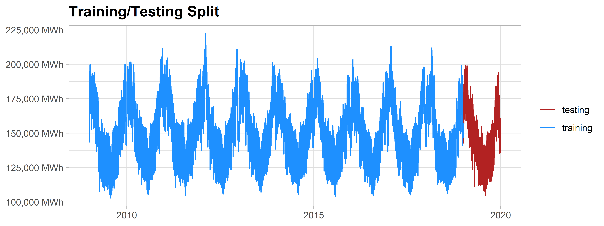
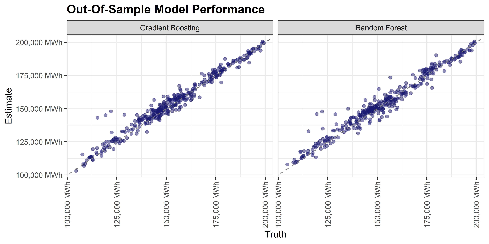
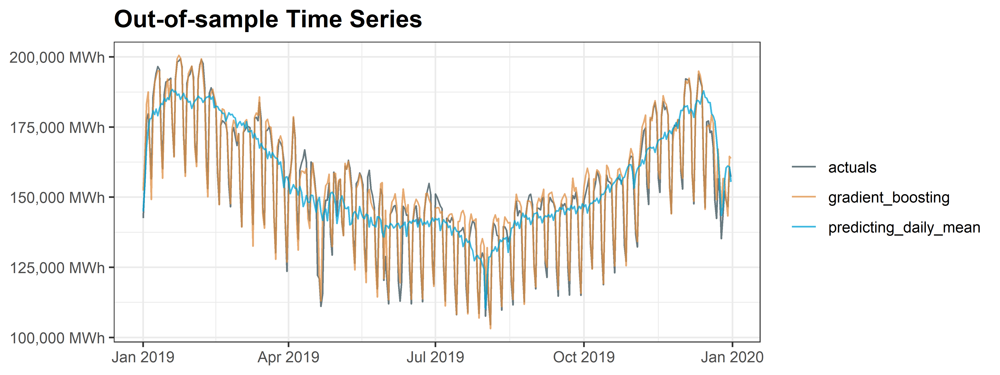
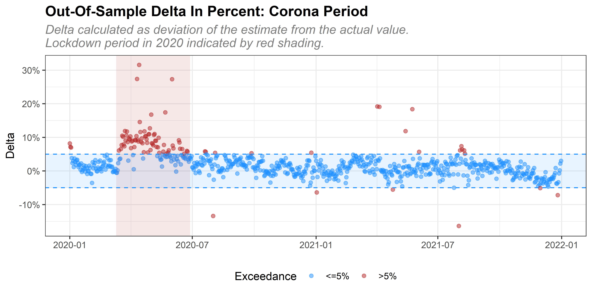

## Forecasting Swiss End-User Electricity Demand With Supervised Machine Learning Methods

### Final Report [(Visit Link)](https://rpubs.com/MathiasSteilen/swiss-energy-forecast-supervised-ml)

The detailed report of this project was hosted on [RPubs](https://rpubs.com/MathiasSteilen/swiss-energy-forecast-supervised-ml). Below, a rough overview over the results of the project is given.

 

### Description

The goal of this project is to test the ability of supervised machine learning models, namely elastic net, gradient boosting and random forest, to predict end-user electricity consumption in Switzerland. The final product is a trained gradient boosting model that takes on a future date, as well as weather data (temperature, humidity, precipitation, cloud coverage), and gives out an accurate estimate of aggregate electricity demand in Switzerland. The final model has an $R^2$ of approximately 97% and a mean absolute percentage error (MAPE) of just under 2%.

 

### Tools

For this project, the programming language R was used with the _tidymodels_ package, which provides a great workflow for supervised machine learning. The _html_, which is also hosted on [RPubs](https://rpubs.com/MathiasSteilen/swiss-energy-forecast-supervised-ml), was knitted using _RMarkdown_.

 

### Data

The electricity demand data comes from [Swissgrid](https://www.swissgrid.ch/en/home/operation/grid-data/generation.html) and is denoted in $kwh$. Additionally, historical weather data is used as an additional predictor, which has been retrieved from [Swiss NBCN](https://data.geo.admin.ch/ch.meteoschweiz.klima/nbcn-tageswerte/liste-download-nbcn-d.csv). The target variable is daily electricity demand denoted in $mwh$. The training/testing split is 10 years to 1 year.

 

### Model Performance

Out of elastic net, random forest and gradient boosting, the latter two were chosen for hyperparameter tuning due to better initial performance with default parameters. After hyperparameter tuning for these two tree-based ensemble models, the final out-of-sample fits can be seen below.

##### Prediction vs. Actuals

From the above chart, it becomes visually clear that the gradient boosting shows fewer outliers than the random forest, explaining the better $R^2$ of the first.

 

##### Out-Of-Sample Time Series

Both models have a very good fit. The gradient boosting model has slightly higher accuracy on most weeks than random forest.

 

##### Comparison of Gradient Boosting to Baseline Model 

Clearly, the gradient boosting model shows solid performance against just predicting the historical target mean and could be used on future data points, after retraining on newer data.

 

### Limitations

Some limitations have to be mentioned where the model might show deficiencies.

 

##### Performance in unforeseen circumstances

Performance of predictive model relies heavily on the continuance of the relation of predictors with the target variable. If the relation breaks down due to unforeseen circumstances like a pandemic, then the model will act as if this event had never happened.

The cloud of red points during the first lockdown shows the model overestimating demand. This abnormal effect has not happened again as the Swiss government have made a strong effort to keep the economy running, however, the period of a couple of months showed the vulnerability of the model. It must be noted that this vulnerability is not unique to this model, virtually all models inferring from the past are subject to it.

 

##### General usability in the energy sector

In practice, the forecast is usually much shorter than one year. Production is adjusted almost in real-time, so forecasts over long time-periods are not useful due to higher uncertainty caused by omitted predictors. Additionally, changing conditions of the predictors have to be accounted for, which is more feasible in real-time, short-term models. This goes hand in hand with the next point.

 

##### Weather readings

The weather readings for the training of this model were actual values. In practice, when predicting energy demand, weather forecasts are part of the features, instead of actual values. This additional uncertainty will likely impact model performance negatively in practice.
